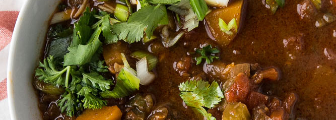

# Het chiligryta på högrev

## Ingredients

- [ ] 1.4 kg högrev
- [ ] 3 msk chilipulver
- [ ] 2 msk spiskummin
- [ ] 0.25 tsk cayennepeppar
- [ ] 0.5 tsk kanel
- [ ] 2 tsk oregano
- [ ] 3 lagerblad
- [ ] 2 tsk honung
- [ ] 1 tsk svartpeppar
- [ ] 1.5 msk salt
- [ ] 3 msk rapsolja
- [ ] 3 st gula lökar
- [ ] 4 st stjälkar selleri
- [ ] 6 st vitlöksklyftor
- [ ] 2 st torkade chipotle chil
- [ ] 1 st torkade ancho chili
- [ ] 2.5 dl köttbuljong
- [ ] 2 msk tomatpure
- [ ] 800 g krossade tomater
- [ ] 30 g mörk choklad
- [ ] 3 cups ris
- [ ] 2 dl gräddfil
- [ ] 1 kruka färsk koriander
- [ ] 1 kruka färsk persilja

## Description

* Servings: 6
* Scaling: 1
* Time: 60 minutes

Het chiligryta gjord på högrev som serveras tillammans med ris och toppas med gräddfil, koriander och persilja.

## Directions

1. Blanda chilipulver, spiskummin, cayennepeppar, kanel, oregano och lagerblad i en liten skål.
2. Skär högreven i kuber och stek i omgångar så den får bra yta tillsammans med salt och peppar.
3. Dela på chipotle chilin och ta ur de mesta av kärnorna.
4. Värm upp vatten och lös upp till rätt mängd buljong, och lägg i chilifrukterna för att få de att mjukna upp.
5. Hacka lök, selleli, vitlök, chilifrukterna och häll i tryckkokaren och bryn tills de blivit lite mjuka.
6. Häll i kryddblandningen, buljongen, tomatpuren, krossade tomater, honung och choklad.
7. Kör på högt tryck i 30 minuter och låt trycket försvinna i 15 minuter.
8. Servera med ris, lite gräddfil samt färsk koriander och persilja.

[Source](https://www.perrysplate.com/2013/01/slow-cooker-steak-chili-aka-the-best-chili-ive-ever-eaten.html)
