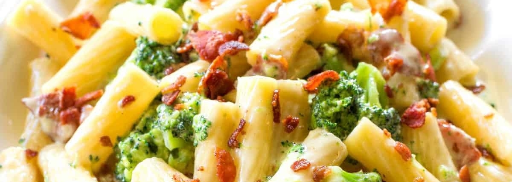

# Pasta med bacon och broccoli

## Ingredients

- [ ] 500 g broccoli
- [ ] 420 g bacon
- [ ] 4 dl crème fraiche tomat och basilika
- [ ] 4 dl mjölk
- [ ] Redning
- [ ] Svartpeppar
- [ ] 750 g penne pasta

## Description

* Servings: 8
* Scaling: 1
* Time: 30 minutes

En enkel pasta med bacon och crème fraiche är precis lika gott som snabblagat. Här viger du dessutom lite plats i pastavattnet åt färsk broccoli som står för det gröna på tallriken.

## Directions

1. Koka pastan enligt anvisningen på förpackningen.
2. Ansa broccolin och skär i mindre bitar och skiva stammen. Koka broccolin med pastan ca 4 minuter.
3. Skär baconet i bitar och stek. Vill du ha en mindre salt och fet sås häll av fettet innan du tillsätter crème fraiche och mjölk. Låt koka upp.
4. Tillsätt lite redning vid behov och smaka av med svartpeppar.
5. Servera pastan och broccolin med såsen.

[Source](https://www.ica.se/recept/baconpasta-med-broccoli-723617/)
